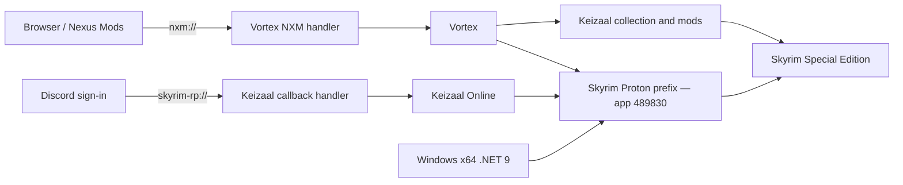

<!-- markdownlint-disable MD013 -->
<!-- markdownlint-disable MD033 -->

# Skyrim Linux Bootstrap

<p align="center">
  <strong>Run Vortex and Keizaal Online for Skyrim Special Edition through Steam Proton—without hand-building the Linux integration.</strong>
</p>

<p align="center">
  <a href="https://github.com/ShubhamPriyadarshi/skyrim-linux-bootstrap/actions/workflows/ci.yml"></a>
  <a href="https://github.com/ShubhamPriyadarshi/skyrim-linux-bootstrap/releases/latest"></a>
  <a href="LICENSE"></a>
  
</p>

<!-- markdownlint-enable MD033 -->

Skyrim Linux Bootstrap is an unofficial, distribution-agnostic installer and
repair toolkit for the **Steam version of Skyrim Special Edition** (app ID
`489830`). It puts Vortex, Keizaal Online, browser callbacks, HiDPI fixes, and
voice diagnostics into the same Proton prefix as Skyrim.

> [!IMPORTANT]
> This project does not contain Skyrim, mods, collections, Vortex, Keizaal,
> Microsoft runtimes, account credentials, or proprietary artwork. It downloads
> or launches official installers and configures only the local integration.

## Why this exists

Vortex and Keizaal can work well on Linux, but their Windows-first assumptions
leave several gaps under Proton. This project automates the fixes that normally
require manual prefix surgery:

- Discovers Skyrim across default, custom, removable, `/nvme`, Flatpak Steam,
  and Snap Steam libraries.
- Runs Vortex and Keizaal inside Skyrim's existing Proton prefix.
- Installs and verifies the Windows x64 .NET 9 Desktop Runtime required by
  current Vortex FOMOD installers.
- Prevents Linux `DOTNET_ROOT` variables from overriding
  `C:\Program Files\dotnet` inside Wine.
- Registers `nxm://` links from a browser with Vortex.
- Registers `skyrim-rp://` Discord/OAuth callbacks with Keizaal.
- Applies per-application Vortex scaling without changing desktop scaling.
- Pins SSE Display Tweaks to a chosen render resolution after alt-tab.
- Detects the Easy Effects routing conflict that can silence Keizaal voice.
- Creates backups before changing game configuration.
- Never reads or prints Keizaal, Discord, Steam, or Nexus tokens.

## Before you begin

You need:

1. A 64-bit Linux desktop and the Steam edition of Skyrim Special Edition.
2. Steam with a Proton compatibility tool selected for Skyrim.
3. Skyrim launched successfully from Steam at least once. This creates the
   `489830` Proton prefix.
4. The official Windows installers for Vortex and the Keizaal launcher.
5. A Nexus Mods account for collection downloads. Free accounts work, but
   Nexus may require confirmation for individual downloads.

<!-- markdown-link-check-disable -->
Use the [official Vortex releases](https://github.com/Nexus-Mods/Vortex/releases/latest)
and the official Keizaal onboarding/download source. The
[Keizaal Online collection](https://www.nexusmods.com/games/skyrimspecialedition/collections/cimlyl/mods)
remains installed through Vortex.
<!-- markdown-link-check-enable -->

> [!WARNING]
> Run this tool as your normal desktop user—not with `sudo`. The individual
> dependency commands request elevation only when the distribution package
> manager needs it.

## Quick start

### 1. Install the bootstrapper

```bash
git clone https://github.com/ShubhamPriyadarshi/skyrim-linux-bootstrap.git
cd skyrim-linux-bootstrap
./install.sh
```

The installer places the application under
`~/.local/share/skyrim-linux-bootstrap`, creates
`~/.local/bin/skyrim-linux-bootstrap`, and adds **Skyrim Linux Bootstrap** to
the desktop application menu.

If your shell cannot find the command immediately, open a new terminal or use
the full path:

```bash
~/.local/bin/skyrim-linux-bootstrap doctor
```

### 2. Check the machine

```bash
skyrim-linux-bootstrap doctor
```

Resolve every `MISSING` item before continuing. The report checks the distro,
Steam library, Skyrim directory, Proton prefix, Protontricks, .NET runtime,
Vortex, Keizaal, and audio defaults without reading private configuration.

### 3. Run the guided setup

From the application menu, open **Skyrim Linux Bootstrap** and choose
**Guided Vortex + Keizaal setup**.

Or run the equivalent command:

```bash
skyrim-linux-bootstrap setup \
  "$HOME/Downloads/Vortex-Setup.exe" \
  "$HOME/Downloads/KeizaalLauncherSetup.exe" \
  1440 900
```

The final width and height are optional. Omit them if the current SSE Display
Tweaks configuration should not be changed:

```bash
skyrim-linux-bootstrap setup \
  "$HOME/Downloads/Vortex-Setup.exe" \
  "$HOME/Downloads/KeizaalLauncherSetup.exe"
```

### 4. Finish in Vortex

1. Sign in to Nexus Mods from Vortex.
2. Install the Keizaal collection and allow every required mod to finish.
3. Ensure the intended Vortex profile is active.
4. Enable and deploy the collection.
5. Close Vortex, open **Keizaal Online**, complete its sign-in, and play.

The bootstrapper does not bypass Nexus authentication, download confirmation,
rate limits, premium features, or the choices made by collection installers.

## How it fits together



Vortex and Keizaal are not installed as native Linux applications. The desktop
entries are native launchers around their official Windows executables in the
same isolated Proton prefix as Skyrim.

## Supported Linux families

The shared discovery and patching core is distro-independent. Only dependency
installation changes by distribution.

| Family | Examples | Dependency route | Validation |
| --- | --- | --- | --- |
| Arch | Arch, CachyOS, EndeavourOS, Manjaro | `pacman` | CachyOS live-tested |
| Debian | Debian, Ubuntu, Mint, Pop!_OS | `apt` | Ubuntu CI |
| Fedora | Fedora, Nobara | `dnf` | Adapter included |
| openSUSE | Tumbleweed, Leap | `zypper` | Adapter included |
| Alpine | Alpine | `apk` + Flatpak Protontricks | Adapter included |
| Immutable | SteamOS, Bazzite, OSTree systems | Flatpak Protontricks | Auto-detected |
| Other | Any system with the required tools | Flatpak or manual dependencies | Community-tested |

The core requires Bash 4+, `curl`, Python 3, XDG utilities, Steam, and
Protontricks. Immutable systems automatically use the Flatpak route. To force it
elsewhere:

```bash
SLB_PROTONTRICKS_MODE=flatpak skyrim-linux-bootstrap install-deps
```

For external Steam libraries, the Flatpak path grants Protontricks access only
to each discovered library rather than exposing the entire filesystem.

## Steam library discovery

The bootstrapper checks:

- Native Steam under `~/.local/share/Steam` and `~/.steam/steam`.
- Flatpak Steam under `~/.var/app/com.valvesoftware.Steam`.
- Snap Steam under `~/snap/steam`.
- Libraries listed in Steam's `libraryfolders.vdf`.
- `/nvme/SteamLibrary` and `/data/SteamLibrary`.
- Mounted `SteamLibrary` directories under `/mnt`, `/media`, and `/run/media`.

For an unusual layout, pass a colon-separated list:

```bash
SLB_STEAM_ROOTS="/games/SteamLibrary:/storage/steam" \
  skyrim-linux-bootstrap doctor
```

Each root must contain a `steamapps` directory.

## Command reference

| Command | Purpose |
| --- | --- |
| `setup VORTEX.exe KEIZAAL.exe [W H]` | Run the guided end-to-end setup. |
| `doctor` | Inspect Steam, the prefix, dependencies, .NET, apps, and audio. |
| `install-deps` | Install host dependencies using the detected distro adapter. |
| `install-vortex [VortexSetup.exe]` | Install the official Vortex release in prefix `489830`. Without a path, the latest official GitHub installer is downloaded. |
| `repair-vortex-runtime [RUNTIME.exe]` | Download or use an offline Windows x64 .NET 9 installer, repair it, and verify it. |
| `verify-vortex-runtime` | Execute Vortex's bundled .NET 9 probe. |
| `patch-vortex` | Regenerate the HiDPI launcher, desktop entry, and `nxm://` handler. |
| `install-keizaal SETUP.exe` | Run the official Keizaal installer in prefix `489830`. |
| `patch-keizaal` | Regenerate the launcher, desktop entry, and `skyrim-rp://` handler. |
| `fix-display WIDTH HEIGHT` | Back up and patch SSE Display Tweaks with a fixed render size. |
| `fix-audio` | Diagnose voice routing; reports Easy Effects conflicts. |
| `fix-audio --uninstall-easyeffects` | Confirm, then remove Easy Effects through the host package manager. |
| `install-desktop` | Reinstall this tool's desktop entry. |
| `gui` | Open a KDialog, Zenity, or terminal action menu. |
| `version` | Print the installed version. |

Global flags:

```text
--dry-run   Print intended changes without applying them
--yes       Accept supported command confirmations
--help      Show built-in command help
```

## Configuration overrides

| Variable | Default | Use |
| --- | ---: | --- |
| `SLB_STEAM_ROOTS` | Auto-discovered | Colon-separated Steam library roots. |
| `SLB_VORTEX_ZOOM` | `1.45` | Vortex-only Electron scale used when regenerating its wrapper. |
| `SLB_PROTONTRICKS_MODE` | Auto | Set to `flatpak` to force Flatpak Protontricks. |
| `SLB_DOTNET_INSTALLER` | Official Microsoft download | Path to an already-downloaded Windows x64 .NET 9 installer. |
| `SLB_DRY_RUN` | `0` | Set to `1` as an alternative to `--dry-run`. |

Example—regenerate Vortex for a 150% desktop using a slightly smaller 145%
application scale:

```bash
SLB_VORTEX_ZOOM=1.45 skyrim-linux-bootstrap patch-vortex
```

Close Vortex before regenerating its wrapper, then reopen it from the desktop
entry.

## Troubleshooting

Start every diagnosis with:

```bash
skyrim-linux-bootstrap doctor
```

### Skyrim or the Proton prefix is missing

Launch Skyrim from Steam once, reach the launcher or main menu, exit normally,
and run `doctor` again. If Skyrim is in a nonstandard library, set
`SLB_STEAM_ROOTS` as shown above.

### Vortex says .NET Desktop Runtime 9 is required

Close Vortex completely—not just to its tray—then run:

```bash
skyrim-linux-bootstrap repair-vortex-runtime
skyrim-linux-bootstrap verify-vortex-runtime
```

The repair uses Microsoft's official Windows x64 runtime. Generated wrappers
remove Linux `DOTNET_ROOT`, `DOTNET_ROOT_X64`, and related variables only from
the Proton child process. Your Linux SDK configuration remains unchanged.

Success ends with a message such as:

```text
Success: Found .NET 9.x.x
```

### Nexus “Download with manager” links do nothing

```bash
skyrim-linux-bootstrap patch-vortex
xdg-mime query default x-scheme-handler/nxm
```

Expected handler:

```text
vortex-nxm.desktop
```

Restart the browser after registering the handler. Use the regular Nexus Mods
download action; this project does not bypass its confirmation page.

### Discord signs in, but Keizaal says the session expired

```bash
skyrim-linux-bootstrap patch-keizaal
xdg-mime query default x-scheme-handler/skyrim-rp
```

Expected handler:

```text
keizaal-online.desktop
```

Close stale Keizaal instances, launch it from the new desktop entry, and retry
sign-in in the same desktop session.

### Vortex is clipped, oversized, or has tiny text

Regenerate its wrapper with an application-specific scale:

```bash
SLB_VORTEX_ZOOM=1.45 skyrim-linux-bootstrap patch-vortex
```

Try values such as `1.25`, `1.45`, or `1.50`, then fully restart Vortex. This
does not change KDE, GNOME, X11, or Wayland scaling.

### Skyrim changes resolution after alt-tab

Pin SSE Display Tweaks to the intended base render resolution:

```bash
skyrim-linux-bootstrap fix-display 1440 900
```

The command backs up `SSEDisplayTweaks.ini`, switches to borderless rendering,
disables borderless upscaling, and prevents buffer resizing from replacing the
chosen resolution.

### Keizaal collection plugins are not detected

In Vortex, confirm that:

1. The collection installation has finished rather than only downloaded.
2. The correct Skyrim Special Edition profile is active.
3. All required mods and plugins are enabled.
4. **Deploy Mods** completes without errors.
5. Skyrim is launched through Keizaal after deployment.

Do not manually copy collection plugins into the game directory; that can make
Vortex's deployment state disagree with the filesystem.

### Keyboard movement does not work but a controller does

Confirm the collection is fully deployed, close Vortex, and restart both
Keizaal and Skyrim. Also check Steam Input and any active controller mappings;
an always-active controller layer can capture gameplay input.

### Players cannot be heard

```bash
skyrim-linux-bootstrap doctor
skyrim-linux-bootstrap fix-audio
```

If Easy Effects is reported and you want it removed:

```bash
skyrim-linux-bootstrap fix-audio --uninstall-easyeffects
```

Removal requires confirmation. The tool never changes microphone or speaker
levels, so settings such as a 33% microphone volume remain untouched. Restart
Skyrim after changing the audio graph.

## What the tool changes

| Location | Change |
| --- | --- |
| `~/.local/share/skyrim-linux-bootstrap/` | Installed CLI, INI patcher, templates, and version. |
| `~/.local/bin/` | Bootstrapper, Vortex, NXM, and Keizaal launchers. |
| `~/.local/share/applications/` | Desktop entries and protocol handlers. |
| Skyrim Proton prefix `489830` | Official Vortex, Keizaal, and Windows .NET installations. |
| `SSEDisplayTweaks.ini` | Changed only by `fix-display`; backed up first. |
| XDG MIME defaults | Associates `nxm://` and `skyrim-rp://` with generated handlers. |

Backups are stored under:

```text
~/.local/state/skyrim-linux-bootstrap/backups/
```

The tool does **not** inspect or copy Keizaal access tokens, Discord cookies,
Nexus credentials, Steam credentials, save files, or mod archives.

## Updating

From a Git clone:

```bash
cd skyrim-linux-bootstrap
git pull --ff-only
./install.sh
skyrim-linux-bootstrap patch-vortex
skyrim-linux-bootstrap patch-keizaal
```

Regenerating the wrappers ensures new compatibility fixes reach existing
desktop entries. It does not reinstall the collection.

## Uninstalling the bootstrapper

Close Vortex and Keizaal, then remove only the files owned by this project:

```bash
rm -rf "$HOME/.local/share/skyrim-linux-bootstrap"
rm -f "$HOME/.local/bin/skyrim-linux-bootstrap" \
  "$HOME/.local/bin/vortex-skyrim" \
  "$HOME/.local/bin/vortex-nxm-handler" \
  "$HOME/.local/bin/keizaal-online"
rm -f "$HOME/.local/share/applications/skyrim-linux-bootstrap.desktop" \
  "$HOME/.local/share/applications/vortex-skyrim.desktop" \
  "$HOME/.local/share/applications/vortex-nxm.desktop" \
  "$HOME/.local/share/applications/keizaal-online.desktop"
```

This intentionally leaves Skyrim, the Proton prefix, Vortex, Keizaal, mods,
the Windows runtime, backups, and game configuration in place. Restore an INI
from the backup directory if you also want to undo `fix-display`.

## Safety and privacy

- `--dry-run` previews supported changes.
- Official downloads use HTTPS.
- Game configuration is backed up before modification.
- Easy Effects removal requires a dedicated flag and confirmation.
- Diagnostics report paths and component status, not configuration contents.
- The project does not automate authentication or circumvent service limits.
- No telemetry is added by this project.

For vulnerability reports, read [SECURITY.md](SECURITY.md). Do not post tokens,
cookies, private logs, or `skymp5-client-settings.txt` in a public issue.

## Getting help

Open a [GitHub issue](https://github.com/ShubhamPriyadarshi/skyrim-linux-bootstrap/issues)
and include:

- Distribution and desktop environment.
- Native, Flatpak, or Snap Steam installation.
- Proton version selected for Skyrim.
- Output from `skyrim-linux-bootstrap doctor`.
- The exact command and error message.
- Whether the Steam library is internal, removable, or custom-mounted.

Review diagnostic output before posting it. Do not attach account databases,
browser profiles, Vortex state files, or Keizaal settings containing tokens.

## Development and contributing

Contributions are welcome. See [CONTRIBUTING.md](CONTRIBUTING.md) before opening
a pull request.

Run the same checks used by CI:

```bash
bash -n bin/skyrim-linux-bootstrap install.sh tests/test.sh
python3 -m py_compile lib/patch_ini.py
shellcheck bin/skyrim-linux-bootstrap install.sh tests/test.sh
bash tests/test.sh
```

When adding distribution support, keep package installation in the adapter
layer and keep discovery and patching distribution-independent.

## Project status

This is an early community project. CachyOS is live-tested and Ubuntu exercises
the portable test suite in CI. Other adapters are implemented but benefit from
real-world reports and contributions. Always keep current backups of saves and
mod profiles when experimenting with any modding tool.

## License and trademarks

Skyrim Linux Bootstrap is licensed under the [MIT License](LICENSE). See [NOTICE](NOTICE)
for the full unofficial-project and trademark notice.

Releases through `v0.1.3` remain available under GPL-3.0. The project is
MIT-licensed beginning with `v0.1.4`; existing grants under earlier releases
remain valid.

Vortex is developed by Nexus Mods and is also distributed under GPL-3.0. Skyrim,
Keizaal Online, Nexus Mods, Steam, Discord, and Microsoft .NET remain the
property of their respective owners. This project is not affiliated with or
endorsed by those projects or companies.
